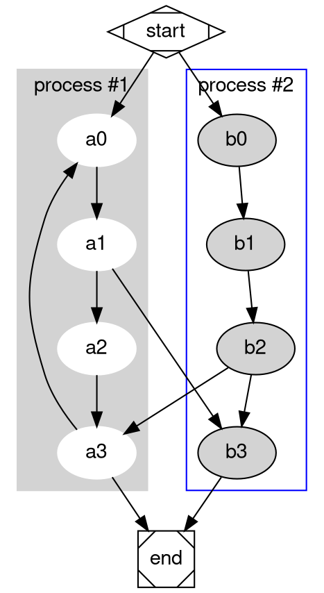

# Consistent Development Environments Across the Universe

## tired

> - `virtualenv` for isolated, snapshot-of-what-`pip`-decided python environments
> - `nvm` for js toolchain pinning
> - `rustup` for rust toolchain pinning
> - `ghcup` for haskell toolchain pinning
> - a million `.foorc` configuration files
> - running things in containers because you're scared that if you upgrade your local version of `terraform` you won't be able to deploy some projects anymore

. . .

```sh
# Install [direnv](https://direnv.net/),
# which will apply/remove the changes here to
# your shell when you cd here.
if [ -d .venv ]; then
    source .venv/bin/activate
    # https://github.com/direnv/direnv/wiki/PS1
    unset PS1
fi
```

## wired

- virtual environments for any toolchain and system dependencies with _one tool_

# `nix`

## What's it for

* imagine no "install `x` `y` and `z`", but not just for python, for _everything_
* activate the special environment just by _being there_

## Why not

* has a reputation for being really hard
* and having lengthy and not awesome docs
* and not being managed especially well

## Why _not_ not

* not that hard to get a lot of the value (e.g. just shells instead of all nix everything)
* docs got [_way better_](https://nix.dev/tutorials/) in the [last year or two](https://zero-to-nix.com/)
* uncertainty about flakes seems to have resolved in favor of flakes, but really, your bets about governance are as good as mine

## Why

* become master of _time_ and _space_ as risks to successful dev environment setup
* plays nicely with terminal tools like direnv

. . .

* maybe not _that_ hard, at least for everything I've talked about so far?

```nix
{
  description = "Presentation flake for demo purposes";

  inputs = {
    nixpkgs.url = "nixpkgs/nixos-23.05";
    flake-utils.url = "github:numtide/flake-utils";
  };

  outputs = { self, nixpkgs, flake-utils, ... }:
  flake-utils.lib.eachDefaultSystem (system:
    let pkgs = nixpkgs.legacyPackages.${system};
    in
      {
        devShells.default = pkgs.mkShell {
          packages = with pkgs; [
            graph-easy
            haskellPackages.patat
            nodejs-18_x
            python311
          ];
        };
      });
}
```

## Payoff

The entire diff required to use a nix flake for development, instead of "just" a virtualenv:

```diff
diff --git a/.envrc b/.envrc
index 3709405..2e4510b 100644
--- a/.envrc
+++ b/.envrc
@@ -1,3 +1,5 @@
+use flake
+
 # Install [direnv](https://direnv.net/),
 # which will apply/remove the changes here to
 # your shell when you cd here.
```

> * assuming you already have a `flake.nix`

# demo time

# `patat`

## `patat`

> * Presentations atop the ANSI terminal
> * write markdown, get slides, don't use a browser
> * like 80% of the language-specific presentation tools

## Evaluate code

```python
class Foo:
  def __init__(self, x, y):
      self.x = x
      self.y = y
      
foo = Foo(3, 4)
print(f"Foo x: {foo.x}, Foo y: {foo.y}")
```

## Evaluate code in different languages

```js
const authenticate = u => {
  return u.username == "james" && u.password == "strong-password-nice";
};
const isAuthenticated = u => console.log(`User ${u.username} is authenticated: ${authenticate(u)}`);

const user1 = {
  username: "james",
  password: "strong-password-nice"
}
const user2 = {
  username: "anyone else"
}
isAuthenticated(user1);
isAuthenticated(user2);
```

## "Process" code-fenced input

* Diamond inheritance (doesn't end up a diamond, but 🤷🏻)
 
```dot
graph {
  d -> c [label="extends"]
  d -> b [label="extends"]
  c -> a [label="extends"]
  b -> a [label="extends"]
}
```

## Process code-fenced input

More complex example from [GraphViz docs](https://graphviz.org/Gallery/directed/cluster.html)



## Show pictures


