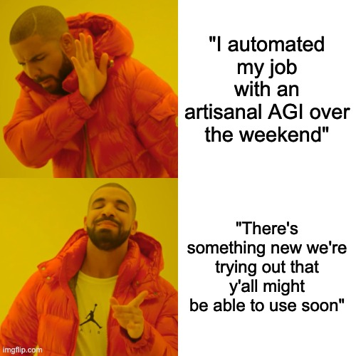
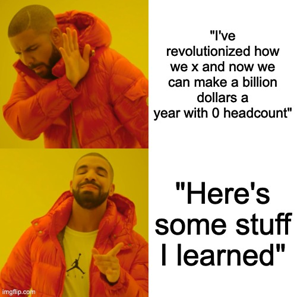
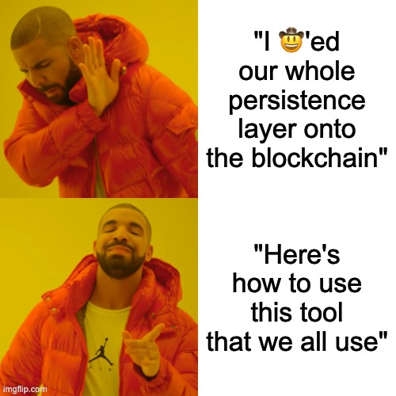

# You have a talk!

## Some stats

| Who          | How many talks |
| ------------ | -------------- |
| A few people | Several        |
| Some people  | 1              |
| Most people  | 0              |

<!--
* My thesis here relies on "some people who have given 0 talks would like to give >= 1 talk"
* The purpose of this talk is to convince you that there's something you know about that you could give a talk to your
coworkers about, and they would find it useful and interesting.
-->

## Why give talks to your coworkers

* Practice explaining technical things
* Receptive audience
* For a minute you can be the "x"-person, which is great if you really like x

<!--
* practice explaining technical things is valuable -- you'll spend a lot of time explaining technical things to people
  with different levels of understanding (product, your own team but people without context, people on different teams,
  stranger at MeetUps), whether or not it's in a talks setting
* knowing "this audience is mostly rooting for me to do a good job, except for my work nemesis, but that's ok" is
  really helpful for refining your style / trying things out
* maybe x for you is DataDog, or weird testing, or terminal tools, or whatever
-->

# What kinds of talks do your coworkers like?

<!--
* Not one thing, but there's a theme
* Mostly, people like practical talks about the problems we're solving
-->

## What kinds of talks do your coworkers like?

<!--
argo workflows
-->

## What kinds of talks do your coworkers like?

<!--
lessons learned from the hackathon
-->

## What kinds of talks do your coworkers like?

<!--
DataDog beginner to advanced, most "I want to see something like this again"
-->

## "But I'm nervous"

* everyone gets nervous
* practice talks: slack me or find another volunteer, people are typically willing to listen to / provide feedback
* record yourself: plenty of good software for this, I like OBS but also I'm a square and there's probably something new written in Rust that solves the same problem "faster"

<!--
* recording: I use OBS, but I'm a square and there's probably something new written in Rust that solves the same problem "faster" or something
* an alternative to trying to manage being nervous about talks is giving a few nervous talks. It's not the most fun
  but really nothing bad happens? And then the next time, you're a little less nervous.
-->

## What's in it for you

* fame, kinda
* a chance to show off
* your other remote coworkers will recognize you when you see them in person or when you need stuff from them during PI planning

<!--
* chance to show off -- all of my talks are also talks about `patat` and nix and terminal tools
-->

## Now you are convinced

Good please sign up at the biweeklies page
